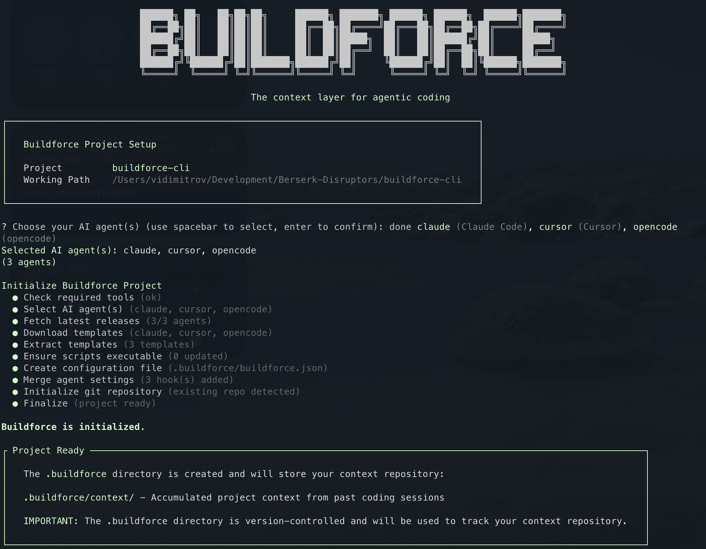

<div align="center">

<picture>
  <source media="(prefers-color-scheme: dark)" srcset=".github/assets/logo-dark.png">
  <source media="(prefers-color-scheme: light)" srcset=".github/assets/logo-light.png">
  
</picture>

**The context layer for agentic coding**

[](https://www.npmjs.com/package/engraph)
[](https://www.npmjs.com/package/engraph)
[](https://github.com/berserkdisruptors/engraph/stargazers)
[](https://www.apache.org/licenses/LICENSE-2.0)

</div>

---

Engraph creates a persistent **context repository** for your codebase that AI coding agents can tap into automatically. Instead of re-explaining architectural decisions, conventions, and design rationale every session, Engraph preserves them in structured, version-controlled files that your agent references transparently.

It works through **skills**, **hooks**, and **sub-agents** that integrate directly into your AI coding agent. When your agent explores the codebase, Engraph hooks intercept the call and route it through the context repository first — giving the agent curated architectural knowledge, not just raw source files.

## Why Engraph?

AI coding agents start fresh with each session, leading to inconsistent implementations and "amnesic" behavior where past decisions are forgotten. Engraph solves this by anchoring your agent to your project's accumulated context.

- **Consistency**: New features align with existing patterns because the agent sees documented architecture and conventions.
- **Reliability**: Design decisions, trade-offs, and rationale persist across sessions.
- **Verification**: Encode testing strategies, validation steps, and quality gates into context that agents reference automatically — so they self-verify against your project's actual standards instead of guessing, and you spend less time reviewing and correcting their work.
- **Efficiency**: Less time spent re-explaining context, more time building.

Context lives in version-controlled YAML files in `.engraph/context/` alongside your code. The repository grows smarter with every feature you complete.

## What Makes It Different

| AI Agent alone                                | AI Agent + Engraph                                              |
| --------------------------------------------- | ------------------------------------------------------------------ |
| Context lost after each session               | Context persists in `.engraph/context/`                         |
| Agent explores only raw source files          | Agent searches curated context first, then source files            |
| Architectural decisions forgotten              | Decisions preserved, searchable, and referenced automatically      |
| Knowledge lives in individual developer heads | Shared context repository for team-wide knowledge                  |
| Each feature starts from scratch              | Each feature builds on accumulated project context                 |
| Conventions enforced manually (if at all)     | Conventions documented and surfaced to agent during development    |
| Agent guesses how to test and validate changes | Agent follows encoded verification steps and testing strategies    |

## Quick Start

### Installation

Install the engraph package globally:

```bash
npm install -g engraph
```

Then initialize in an existing project:

```bash
engraph init .
```

Initialize a new project:

```bash
engraph init my-project
```

Or with npx:

```bash
npx engraph init .
```

<div align="center">

</div>

### Upgrading to the Latest Version

To upgrade an existing Engraph project to the latest version:

```bash
engraph upgrade
```

The upgrade command will:

- **Interactively prompt** you to select or modify your AI agents (matching the init experience)
- Update skills, sub-agents, and hooks to the latest versions
- Merge agent-specific settings (hooks, plugins) for each selected agent
- Preserve your existing context repository and configuration

**Options:**

```bash
# Skip the interactive prompt and upgrade specific AI agent(s)
engraph upgrade --ai claude

# Debug mode for troubleshooting
engraph upgrade --debug
```

### How To Use

After `engraph init`, open your AI coding agent in the project and start working as usual. Engraph works transparently in the background:

1. **Context search happens automatically** — when your agent explores the codebase, Engraph hooks route the exploration through your context repository first, enriching the agent's understanding with curated architectural knowledge.

2. **Extract context after completing work** — run the `/context-extract` skill to capture new knowledge (architecture decisions, conventions, design rationale) into the context repository for future sessions.

That's it. No special workflow to follow. Your agent gets smarter context automatically, and you capture knowledge when you want to preserve it.

> For a fresh project with no context yet, bootstrap the repository, by running the `context-extract` skill with no additional arguments. Use it with arguments if you want to extract deeper context on a specific topic.

## How It Works

Engraph integrates into your AI coding agent through three mechanisms:

```
┌─────────────────────────────────────┐
│         Your AI Coding Agent        |
└──────────┬──────────────────────────┘
           │
           │              Agent tries to explore codebase
           │
     ┌─────▼──────┐
     │    Hooks   │       Intercept explore calls
     └─────┬──────┘
           │
           │              Redirect to engraph-explorer
           |              (which calls the context-search
           |              skill)
           │
   ┌───────▼────────┐
   │   Sub-Agents   │     Search context repository
   │                │     (structural, conventions,
   │                │     verification explorers)
   └───────┬────────┘
           │
  ┌────────▼───────────┐
  │ Context Repository │  .engraph/context/
  │                    │  structural/, conventions/,
  │                    │  verification/
  └────────────────────┘
```

### Hooks

Hooks intercept your agent's explore/search calls and redirect them through the Engraph context repository. Each supported agent has its own hook mechanism:

- **Claude Code**: PreToolUse hook in `.claude/settings.local.json` that intercepts Task tool calls with `subagent_type: "Explore"` and redirects to `engraph-explorer`
- **Cursor**: preToolUse hook in `.cursor/hooks.json` with a shell script (`.cursor/hooks/setup-explorer-subagent.sh`) that performs the same redirection
- **OpenCode**: Plugin in `.opencode/plugins/` that intercepts task tool calls and redirects explore requests

This happens transparently — your agent doesn't need to know about Engraph. It just gets better context.

### Sub-Agents

Engraph installs specialized sub-agents into your agent's configuration:

- **Explorers**: Triggered by the `context-search` skill to scan the context repository for structural, conventions, and verification knowledge.
- **Extractors**: Used by the `context-extract` skill to extract specific context files from the codebase

### Skills

Two skills are installed as slash commands that can be invoked manually or triggered automatically:

- **`context-search`** — Search the context repository for curated codebase knowledge. Dispatches explorers in parallel and synthesizes findings. Normally invoked automatically via hooks when your agent explores, but can also be used manually for direct queries.

- **`context-extract`** — Extract and update context files from the codebase. Supports three modes:
  - **Cold start**: Bootstrap the entire context repository for a new project
  - **Incremental**: Update context after recent implementation changes
  - **Deep dive**: Focused extraction on specific modules or topics

## The Context Repository

The context repository lives in `.engraph/context/` and is organized into three domains:

```
.engraph/context/
├── _index.yaml              # Repository metadata and cross-references
├── structural/            # Structural context
│   ├── module-name.yaml     # Module architecture, dependencies, design decisions
│   └── ...
├── conventions/             # Coding standards and patterns
│   ├── naming-conventions.yaml
│   └── ...
└── verification/            # Testing and quality context
    ├── test-strategy.yaml
    └── ...
```

These files capture knowledge that source code alone cannot convey: **why** something was built a certain way, what patterns to follow, what trade-offs were made, and how components relate. This is the knowledge that typically lives in developers' heads and gets lost between sessions.

Context files are version-controlled YAML, designed to be reviewed in PRs alongside code changes.

> Read more here if you want to get a [deeper understanding of our context taxonomy](https://engraph.dev/engraph/concepts/context-taxonomy)

## Supported AI Agents

Engraph currently supports three AI coding agents with full integration (skills, hooks, and sub-agents):

| Agent | Hooks | Skills | Sub-Agents |
|-------|-------|--------|------------|
| **Claude Code** | PreToolUse in `settings.local.json` | context-search, context-extract | All 7 engraph agents |
| **Cursor** | preToolUse in `hooks.json` + shell script | context-search, context-extract | All 7 engraph agents |
| **OpenCode** | Plugin in `.opencode/plugins/` | context-search, context-extract | All 7 engraph agents |

### Want support for another agent?

Support for **Gemini CLI**, **Codex CLI**, **GitHub Copilot**, and others is planned but not yet implemented. We can't test every agent ourselves, so we're relying on community contributions.

If you use an agent that isn't supported yet, we'd love your help adding it. The integration pattern is straightforward — each agent needs:

1. A hook mechanism to intercept explore calls and redirect to `engraph-explorer`
2. Skills and sub-agent templates in the agent's configuration folder
3. A settings merge strategy in `src/utils/settings-merge.ts`

Check the existing implementations for Claude, Cursor, and OpenCode as reference. [Open an issue](https://github.com/berserkdisruptors/engraph/issues) to discuss or submit a PR.

---

## Contributing

Engraph is **open source** and welcomes contributions! We're building the context layer for agentic coding together.

### Quick Start for Contributors

```bash
git clone https://github.com/berserkdisruptors/engraph.git
cd engraph
npm install
npm run build
npm link
```

### Testing

We use [Vitest](https://vitest.dev/) with a three-tier testing strategy:

- **Unit tests** (`tests/unit/`) — fast, isolated tests for individual functions and modules
- **Integration tests** (`tests/integration/`) — test interactions between components (filesystem, config loading)
- **E2E tests** (`tests/e2e/`) — test full CLI commands against real project fixtures

All PRs must pass the full test suite. Aim to add tests for any new functionality or bug fixes.

```bash
npm test                  # Run all tests
npm run test:unit         # Unit tests only
npm run test:integration  # Integration tests only
npm run test:e2e          # End-to-end tests only
npm run test:coverage     # Run tests with coverage report
npm run test:watch        # Watch mode for development
```


### How to Contribute

1. **Check existing issues** - [View open issues](https://github.com/berserkdisruptors/engraph/issues)
2. **Create an issue** - Describe the problem or feature request
3. **Fork & branch** - Create a feature branch following our naming convention
4. **Write tests** - Add unit/integration/e2e tests for your changes
5. **Run the test suite** - `npm test` to verify everything passes
6. **Submit PR** - Describe your changes and link related issues

Adding support for a new AI agent is a great way to contribute — see [Supported AI Agents](#supported-ai-agents) for details.

---

## Support & Community

- **Website**: [https://engraph.dev/engraph](https://engraph.dev/engraph) - Learn more about Engraph
- **GitHub Repository**: [https://github.com/berserkdisruptors/engraph](https://github.com/berserkdisruptors/engraph)
- **npm Package**: [https://www.npmjs.com/package/engraph](https://www.npmjs.com/package/engraph)
- **GitHub Issues**: [Report bugs or request features](https://github.com/berserkdisruptors/engraph/issues)
- **Discussions**: [Ask questions or share ideas](https://github.com/berserkdisruptors/engraph/discussions)

---

## License

Apache License 2.0 - see [LICENSE](LICENSE) for details.

---

## Star the Project! ⭐

If Engraph helps your AI coding agent make better decisions, please star the project on GitHub. It helps us reach more developers and build a stronger community.

[**Star Engraph on GitHub**](https://github.com/berserkdisruptors/engraph)

---

**Made with 💪 by [Berserk Disruptors](https://github.com/berserkdisruptors)**

_The context layer for agentic coding, one context file at a time._
